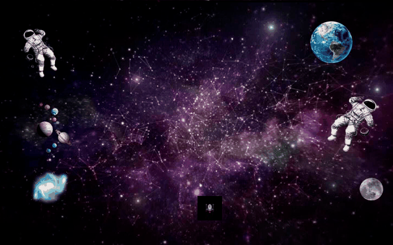

# 🎮 The PachVic Adventure




Un emocionante juego de aventura espacial desarrollado en Python utilizando Pygame, donde controlas una nave intergaláctica navegando por un espacio lleno de obstáculos y recompensas.

## 📝 Descripción

**The PachVic Adventure** es un juego arcade de aventura espacial estilo "endless runner" donde el jugador debe esquivar meteoritos mientras recolecta estrellas/monedas para aumentar su puntuación. El juego presenta mecánicas de energía, sistema de puntuación, y una experiencia visual atractiva con sprites espaciales personalizados y efectos de sonido inmersivos.

### Características Principales

- 🚀 **Sistema de juego dinámico**: Esquiva meteoritos en movimiento
- 💰 **Recolección de recompensas**: Acumula puntos y aumenta tu energía
- ⚡ **Sistema de energía**: Administra los escudos de tu nave para sobrevivir
- 🎵 **Efectos de sonido**: Experiencia auditiva inmersiva
- 👤 **Gestión de jugadores**: Sistema de guardado con nombres personalizados
- 🏆 **Tabla de clasificación**: Registra y consulta los mejores puntajes
- ⚙️ **Opciones configurables**: Ajusta la velocidad y modo de pantalla completa
- 🎨 **Sprites espaciales**: Gráficos únicos de naves y meteoritos

## 🛠️ Requisitos del Sistema

- Python 3.7 o superior
- Pygame
- Sistema operativo: Windows, macOS, o Linux

## 📦 Instalación

1. **Clonar el repositorio**:
```bash
git clone https://github.com/tuusuario/the-pachvic-adventure.git
cd the-pachvic-adventure
```

2. **Instalar las dependencias**:
```bash
pip install -r Requirements.txt
```

O instalar Pygame directamente:
```bash
pip install pygame
```

## 🎮 Cómo Jugar

### Iniciar el Juego

```bash
python main.py
```

### Controles

- **Flechas Izquierda/Derecha** o **A/D**: Mover el personaje
- **Mouse**: Interactuar con menús y botones
- **ESC**: Regresar al menú principal (durante el juego)

### Objetivo del Juego

1. **Esquiva los meteoritos** que se dirigen hacia ti en el espacio
2. **Recolecta recompensas (monedas)** para aumentar tu puntuación y recargar tus escudos
3. **Administra tu energía** - ¡tu nave se destruye cuando la energía llega a 0!
4. **Consigue la puntuación más alta** y registra tu nombre en la tabla de clasificación de la galaxia

### Mecánicas de Juego

- **Energía**: Comienza con 100 puntos de escudo (energía)
  - Colisionar con meteoritos reduce la energía
  - Recolectar recompensas aumenta la energía
  - El juego termina cuando la energía llega a 0

- **Puntuación**: 
  - Cada objeto recolectado suma puntos
  - La puntuación final se guarda en el sistema de clasificación

- **Velocidad**: 
  - Configurable desde el menú de opciones
  - Afecta la dificultad del juego

## 📂 Estructura del Proyecto

```
The PachVic Adventure/
│
├── main.py                 # Archivo principal que ejecuta el juego
├── settings.py             # Configuraciones, variables y constantes globales
├── state.py                # Estado dinámico del juego
├── sprites.py              # Definición de clases de nave, meteoritos, etc.
├── ui.py                   # Elementos de interfaz gráfica (botones, cajas de texto)
├── proyecto_old.py         # Respaldo del código original monolítico
├── proyecto.spec           # Especificaciones de PyInstaller
├── requirements.txt        # Dependencias del proyecto
├── LICENSE                 # Licencia del proyecto
├── README.md               # Este archivo
├── .gitignore              # Archivos ignorados por Git
│
├── media/                  # Archivos multimedia para documentación
│   └── gameplay.gif        # Animación demostrativa del juego
│
├── sprites/                # Recursos gráficos
│   ├── Nave2.jpg           # Sprite de la nave (jugador)
│   ├── Porta.png           # Fondo del menú
│   ├── levelBackground.png # Fondo del nivel espacial
│   ├── moneda.png          # Sprite de recolección
│   └── m1.png, m2.jpg, m3.jpg # Sprites de meteoritos
│
├── sounds/                 # Efectos de sonido
│   ├── crash.wav          # Sonido de colisión
│   ├── success-1-6297.wav # Sonido de recolección
│   ├── gameOver.wav       # Sonido de juego terminado
│   └── Snow-Bros-Theme.wav # Música de fondo
│
├── save/                   # Archivos de guardado
│   └── saved_games.json   # Datos de jugadores guardados
│
└── build/                  # Archivos de compilación (PyInstaller)
```

## 🎯 Funcionalidades Detalladas

### Sistema de Menús

1. **Menú Principal**:
   - Nuevo Juego
   - Continuar (si hay partidas guardadas)
   - Clasificación
   - Configuración
   - Salir

2. **Menú de Configuración**:
   - Ajuste de velocidad
   - Modo pantalla completa
   - Volver al menú principal

3. **Sistema de Guardado**:
   - Ingresar nombre de jugador
   - Guardar progreso automático
   - Cargar partidas anteriores

### Clases Principales (en `sprites.py` y `ui.py`)

- **`kar`**: Clase del jugador (nave espacial)
- **`enemyCar`**: Clase de obstáculos (meteoritos)
- **`thing`**: Clase de objetos recolectables
- **`landscape`**: Clase del fondo estrellado en movimiento
- **`button`**: Clase para botones de interfaz
- **`InputBox`**: Clase para cuadros de texto

## 🔧 Compilación del Ejecutable

Para crear un ejecutable del juego usando PyInstaller:

```bash
pyinstaller proyecto.spec
```

El ejecutable se generará en la carpeta `dist/`.

## 🎨 Personalización

### Modificar Velocidad del Juego

La velocidad se puede ajustar desde el menú de configuración o modificando la variable `speed` en el código:

```python
speed = 5  # Valores recomendados: 1-10
```

### Agregar Nuevos Sprites

1. Coloca tu imagen en la carpeta `sprites/`
2. Modifica la clase correspondiente en `proyecto.py`
3. Actualiza la carga de imagen con la nueva ruta

### Agregar Nuevos Sonidos

1. Coloca tu archivo de audio (.wav) en la carpeta `sounds/`
2. Carga el sonido en el código:
```python
nuevoSonido = pygame.mixer.Sound(directory + "\\sounds\\tusonido.wav")
```

## 🐛 Solución de Problemas

### El juego no inicia
- Verifica que tienes instalado Pygame: `pip install pygame`
- Asegúrate de estar ejecutando con Python 3.7+

### No se escucha el audio
- Verifica que los archivos de audio estén en la carpeta `sounds/`
- Comprueba que tu sistema tenga salida de audio funcionando
- Ajusta el volumen del sistema

### Errores de archivo no encontrado
- Asegúrate de ejecutar el juego desde el directorio raíz del proyecto
- Verifica que todas las carpetas (`sprites/`, `sounds/`, `save/`) existan

## 📜 Licencia

Este proyecto está bajo la licencia especificada en el archivo `LICENSE`.

## 👥 Autores

- **PachVic Team** - Desarrollo y diseño inicial

## 🙏 Créditos

- **Pygame Community** - Framework de desarrollo
- **Snow Bros** - Inspiración musical
- Sprites y assets personalizados creados para el proyecto

## 📞 Contacto

Para preguntas, sugerencias o reportar bugs, por favor abre un issue en el repositorio.

---

¡Disfruta jugando **The PachVic Adventure**! 🎮✨
